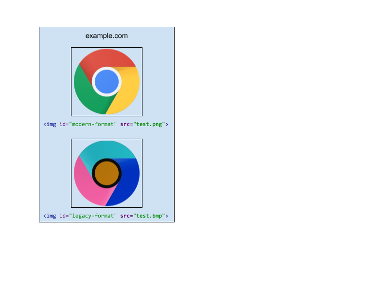
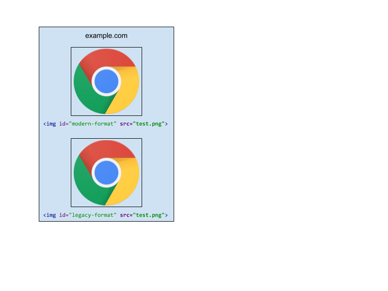
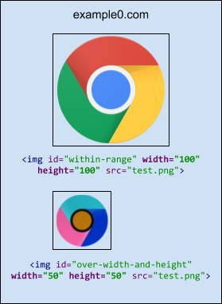
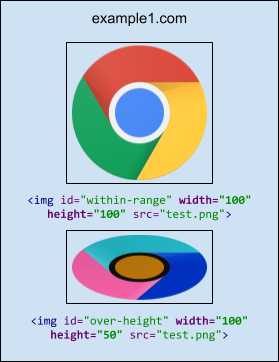
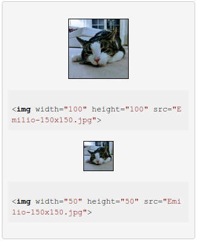
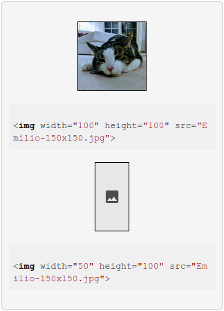
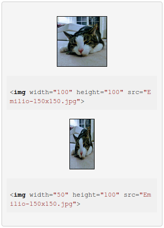

# Optimized Image Policies Explainer

loonybear@, last updated: 4/25/2018

<span style="color:#38761d;">Status: Draft Proposal</span>


## Goal

Images make up majority of the downloaded bytes on websites. In addition, images often occupy a significant amount of visual space. Optimizing images can improve loading performance and reduce network traffic. Surprisingly, more than half of the sites on the web, including advanced ones, are shipping unoptimized images. This means these sites can all achieve a performance improvement by serving optimized images.

Optimized image policies are aiming to solve problems with sites shipping images that are poorly compressed or unnecessarily large.


## What are "Optimized Image Policies"?

Optimized image policies introduce a set of restrictions (policies) on images that can be applied with dev-time enforcement. An image will be rendered with **inverted colors** when violating a policy, making it easy for web developers to identify and fix the error.


### Optimized image policies

*   **["legacy-image-formats" policy](#legacy-image-formats)**
    *   Images must be of one of the _**modern formats***_ (JPEG, PNG, WEBP, etc).
*   **["maximum-downscaling-image" policy](#maximum-downscaling-image)**
    *   Images must not be bigger than its container size by more than _**X times***_ .
*   **["image-compression" policy](#image-compression)**
    *   Images used in rendering must not include too much metadata.
    *   Images must not be more than _**X bits***_ per compressed pixel.

**Note**: We want to allow developers the ability to make the final decision about the tradeoffs they make. * means developers will eventrually be able to specify the "value" of the policy. For example, `maximum-downscaling-image(2)` specifies the maximum ratio (2) images are allowed to be downscaled by.


## Detailed policy discussion

<a name="legacy-image-formats">

### "legacy-image-formats" policy

</a>

Image formats affect file size, loading speed and appearance. Modern image formats yield large byte savings and performance improvement. `legacy-image-formats` is a policy controlled feature that restricts images to be one of certain modern formats.

When a document is disallowed to use `legacy-image-formats` policy, its `` elements will render images of "legacy" formats with inverted colors.


#### Specification

- The default list of modern image formats is: JPEG, PNG, GIF, WEBP, and SVG.

    **Note**: The goal is to eventually introduce a syntax for specifying which modern formats can be allowed. The developer can choose this minimum set (default list), or can add additional formats which they either know can be rendered fast, or just need for their site.

    In practice, they would look something like this:

    ```html
    <iframe allow="legacy-image-formats(JPEG, PNG, TIFF)"></iframe>
    ```
    That would apply a policy in which just those three formats (JPEG, PNG, TIFF) can be allowed.

    Feature policies combine in subframes, so if that frame embedded another, which the syntax:

    ```html
    <iframe allow="legacy-image-formats(JPEG, GIF, BMP)"></iframe>
    ```
    then the child frame would be allowed to render images of just "JPEG" format.

- The default allowlist for `legacy-image-formats` is `*`. This means for pages of all origins, `` elements with "legacy" formats will be allowed and rendered correctly by default.

- A `legacy-image-formats` policy can be specified via:

    1. HTTP "Feature-Policy" response header:

    ```html
    Feature-Policy: legacy-image-formats 'none';
    ```
    In this example, `legacy-image-formats` is disabled for all frames including the main frame. All `` elements with "legacy" formats will be rendered with inverted colors.

    2. "allow" attribute in <iframe>:

    ```html
    <iframe src="https://example.com" allow="legacy-image-formats 'self' https://foo.com;">
    ```
    In this example, `legacy-image-formats` is disabled everywhere except on the origin of the main document and on `https://foo.com`.


#### Example

<table>
  <tr align="center">
   <td>Feature-Policy: legacy-image-formats 'none';</td>
   <td>Feature-Policy: legacy-image-formats *;</td>
  </tr>
  <tr align="center">
   <td>
  
   </td>
   <td>
  
   </td>
  </tr>
  <tr align="center">
   <td colspan="2" >

```html
"example.com"


```
   </td>
  </tr>
</table>

For an `` element, if its `src` is one of the modern image formats, the image will be rendered correctly; otherwise the image will be rendered with inverted colors.
</br></br>

<a name="maximum-downscaling-image">

### "maximum-downscaling-image" policy

</a>

On a web page, the number of pixels of a container determines the resolution of an image served inside. It is unnecessary to use an image that is much larger than what the viewing device can actually render; for example, serving a desktop image to mobile contexts, or serving an image intended for high-pixel-density screens to a low-pixel-density device. This results in unnecessary network traffic and downloaded bytes. `maximum-downscaling-image` is a policy controlled feature that restricts images to be no more than X times bigger than the container size.

When a document is disallowed to use `maximum-downscaling-image` policy, its `` elements that are more than X times larger than its container size will be rendered with inverted colors.


#### Specification

- The default downscaling ratio is 2.

    **Note**: The goal is to eventually introduce a syntax for specifying the maxmimum downscaling ratio to be allowed.

    In practice, they would look something like this:

    ```html
    <iframe allow="maximum-downscaling-image(4)"></iframe>
    ```
    That would apply a policy in which the maximum downscaling ratio allowed is set to 4.

    Feature policies combine in subframes, and the minimum value of the downscaling ratio will be applied, so if that frame embedded another, which the syntax:

    ```html
    <iframe allow="maximum-downscaling-image(5)"></iframe>
    ```
    then the child frame would be allowed to render images with maximum downscaling ratio of 4.

    If that frame embedded another child frame of the syntax:

    ```html
    <iframe allow="maximum-downscaling-image(3)"></iframe>
    ```
    then the other child frame would be allowed to render images with maximum downscaling ratio of 3.

- The default allowlist for `maximum-downscaling-image` is `*`. This means for pages of all origins,
`` elements that are more than X times larger than its container size will be allowed and rendered correctly.

- A `maximum-downscaling-image` policy can be specified via:

    1. HTTP "feature-policy" response header:

    ```html
    Feature-Policy: maximum-downscaling-image 'none';
    ```
    In this example, `maximum-downscaling-image` is disabled for all frames including the main frame. All `` elements that are more than X times larger than its container size will be rendered with inverted colors.

    2. "allow" attribute in <iframe>:

    ```html
    <iframe src="https://example.com" allow="maximum-downscaling-image 'self' https://foo.com;">
    ```
    In this example, "maximum-downscaling-image" is disabled everywhere except on the origin of the main document and on `https://foo.com`.


#### Examples

<table>
  <tr align="center">
   <td>Feature-Policy: maximum-downscaling-image 'none';</td>
   <td>Feature-Policy: maximum-downscaling-image *;</td>
  </tr>
  <tr aligh="center">
   <td>

   </td>
   <td>

   </td>
  </tr>
  <tr align="center">
   <td colspan="2" >

```html
"example0.com"
test.png: 150px X 150px


```
   </td>
  </tr>
</table>

For an `` element, if neither the width or the height of the source image exceeds the number of pixels allowed by the policy in the container (by default, 2 times of its container's width of height), the image will be rendered correctly;  if both the width and the height of the source image exceed the limit, the image will be rendered with inverted colors.


<table>
  <tr align="center">
   <td>Feature-Policy: maximum-downscaling-image 'none';</td>
   <td>Feature-Policy: maximum-downscaling-image *;</td>
  </tr>
  <tr aligh="center">
   <td>

   </td>
   <td>

   </td>
  </tr>
  <tr align="center">
   <td colspan="2" >

```html
"example1.com"
test.png: 150px X 150px


```
   </td>
  </tr>
</table>

For an `` element, if neither the width or the height of the source image exceeds the number of pixels allowed by the policy in the container (by default, 2 times of its container's width or height), the image will be rendered correctly; if the width the source image exceeds the limit, the image will be rendered with inverted colors.


<table>
  <tr align="center">
   <td>Feature-Policy: maximum-downscaling-image 'none';</td>
   <td>Feature-Policy: maximum-downscaling-image *;</td>
  </tr>
  <tr aligh="center">
   <td>

   </td>
   <td>

   </td>
  </tr>
  <tr align="center">
   <td colspan="2" >

```html
"example2.com"


```
   </td>
  </tr>
</table>

For an `` element, if neither the width or the height of the source image exceeds the number of pixels allowed by the policy in the container (by default, 2 times of its container's width or height), the image will be rendered correctly; if the height the source image exceeds the limit, the image will be rendered with inverted colors.
</br></br>

<a name="image-compression">

### "image-compression" policy

</a>

When optimizing images, the file size should be kept as small as possible. The larger the download size is, the longer it takes a page to load. Stripping metadata, or using image compression, is a common way to optimize an image's file size. "image-compression" is a policy controlled feature that restricts images to have a file size (in terms of number of bytes) no more than X times bigger than the image size (width * height) on the web page.

When a document is disallowed to use "image-compression" policy, its `` elements whose file sizes are too big will be rendered with inverted colors. 


#### Specification

The default compression ratio is tentatively 10. 

---

**Note**: We want to allow developers the ability to make the final decision about the tradeoffs they make. The goal is to eventually introduce a syntax for specifying their own ratio. 

In practice, they would look something like this:

```html
<iframe allow="image-compression(12)"></iframe>
```

That would apply a policy in which the maximum compression ratio allowed is set
to 12. 


Feature policies combine in subframes, and the minimum value of the compression
ratio will be applied, so if that frame embedded another, which the syntax:

```html
<iframe allow="maximum-downscaling-image(15)"></iframe>
```

then the child frame would be allowed to render images with maximum compression
ratio of 12.

If that frame embedded another child frame of the syntax:

```html
<iframe allow="maximum-downscaling-image(9)"></iframe>
```

then the other child frame would be allowed to render images with maximum
compression ratio of 9.

---

The default allowlist for "image-compression" is *. This means for pages of all origins, `` elements whose file sizes exceeds the compression ratio will be allowed and rendered correctly.


A "image-compression" policy can be specified via:

1. HTTP "feature-policy" response header:
```html
Feature-Policy: image-compression 'none'; <more policies> 
```

In this example, "image-compression" is disabled for all frames including the main frame. All `` elements whose file sizes exceeds the compression ratio will be rendered with inverted colors.

2. "allow" attribute in <iframe>:
```html
<iframe src="https://example.com" allow="image-compression 'self' https://foo.com;">
```
 
In this example, "image-compression" is disabled everywhere except on the origin of the main document and on `https://foo.com`.  


#### Examples

<table>
  <tr>
   <td>"Feature-Policy: image-compression 'none';"
   </td>
   <td>"Feature-Policy: image-compression *;"
   </td>
  </tr>
  <tr>
   <td>

<!---->

   </td>
   <td>

<!---->

   </td>
  </tr>
  <tr>
   <td colspan="2" ><code>example.com</code>
<p>
<code></code>
<p>
<code></code>
   </td>
  </tr>
</table>


For an `` element, if its file size is within the compression limit, the image will be rendered correctly; otherwise the image will be rendered with inverted colors.

