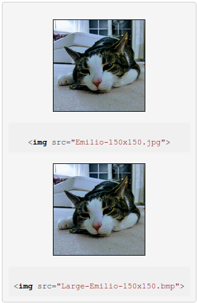

#  Image Policies Explainer

loonybear@, last updated: 03/13/2019

<span style="color:#38761d;">Status: in [Origin Trials](https://github.com/GoogleChrome/OriginTrials) in M75</span>


## Goal

Images make up majority of the downloaded bytes on websites. In addition, images often occupy a significant amount of visual space. Optimizing images can improve loading performance and reduce network traffic. Surprisingly, more than half of the sites on the web, including advanced ones, are shipping unoptimized images. This means these sites can all achieve a performance improvement by serving optimized images.

Optimized image policies are aiming to solve problems with sites shipping images that are poorly compressed or unnecessarily large.


## What are "Optimized Image Policies"?

Optimized image policies introduce a set of restrictions (policies) on images that can be applied with dev-time enforcement. An image will be rendered as a **placeholder image** when violating a policy, making it easy for web developers to identify and fix the error.


### Optimized image policies

*   **["oversized-images" policy](#oversized-images)**
    *   The intrinsic dimensions of `` elements must not be larger than the container size by more than _***X times***_.
*   **["unoptimized-*-images" policy](#unoptimized-images)**
    *   Images used in rendering must not include too much metadata.
    *   Images should be in one of the modern image formats that yield large byte savings and performance improvement.
    *   **"unoptimized-lossy-images"**
        *   A lossy type `` element should not exceed a byte-per-pixel ratio of _***X***_, with a fixed _**1KB**_ overhead allowrance.
    *   **"unoptimized-lossless-images"**
        *   A lossless type `` element should not exceed a byte-per-pixel ratio of _***X***_, with a fixed _**1KB**_ overhead allowrance.
    *   **"unoptimized-lossless-images-10k"**
        *   A lossless type `` element should not exceed a byte-per-pixel ratio of _***X***_, with a fixed _**10KB**_ overhead allowrance.

**Note**: We want to allow developers the ability to make the final decision about the tradeoffs they make. _***X***_ means developers can specify the "value" of the policy. For example, `oversized-images *(2)` specifies the maximum ratio, 2, images are allowed to oversize by.


## Experiment image policies with Origin Trials

Image policieis are shipped in Chrome M75 via Origin Trials.

You can request a token for your origin to opt any page on your origin into the trail of ["oversized-images" policy](https://developers.chrome.com/origintrials/#/trials/active), ["unoptimized-lossy-images"](https://developers.chrome.com/origintrials/#/trials/active), ["unoptimized-lossless-images"](https://developers.chrome.com/origintrials/#/trials/active), ["unoptimized-lossless-images-10k"](https://developers.chrome.com/origintrials/#/trials/active).

Once you have a token, you can provide the token on any pages in your origin using an `Origin-Trial` HTTP header:
```
Origin-Trial: **token as provided in the developer console**
```

Please see sessions below on how to specify an image policy via HTTP header `Feature-Poliy` header. 

For more details, see [Origin Trials Guide for Web Developers](https://github.com/GoogleChrome/OriginTrials/blob/gh-pages/developer-guide.md).


## Detailed policy discussion

<a name="oversized-images">
   
### "oversized-images" policy

</a>

On a web page, the number of pixels of a container determines the resolution of an image served inside. It is unnecessary to use an image that is much larger than what the viewing device can actually render; for example, serving a desktop image to mobile contexts, or serving an image intended for high-pixel-density screens to a low-pixel-density device. This results in unnecessary network traffic and downloaded bytes. `oversized-images` is a policy controlled feature that restricts images to be no more than X times bigger than the container size.

When a document is disallowed to use `oversized-images` policy, its `` elements that are more than X times larger than the container size will be rendered as a placeholder image.

To try `oversized-images` policy, register a token [here](https://developers.chrome.com/origintrials/#/trials/active) and specify the policy via HTTP `Feature-Policy` header (see section below for more details).


#### Specification

- The default allowlist for `oversized-images` is `*(inf)`. This means for pages of all origins,
all `` elements will be allowed and rendered correctly by default.


- An `oversized-images` policy can be specified via:

    **1. [HTTP `Feature-Policy`](https://developer.mozilla.org/en-US/docs/Web/HTTP/Headers/Feature-Policy) response header:**
    ```html
    Feature-Policy: oversized-images *(0);
    ```
    In this example, `oversized-images` is **disabled for all frames** including the main frame. All `` elements will be rendered as placeholder images as their intrinsic dimensions will be more than 0 (0 times larger than the container size).

    **2. [`allow` attribute in <iframe>](https://developer.mozilla.org/en-US/docs/Web/HTML/Element/iframe#Attributes):**
    ```html
    <iframe src="https://example.com" allow="oversized-images 'self'(2) https://foo.com(3);">
    ```
    In this example, `oversized-images` is **disabled everywhere except on the origin of the main document and on `https://foo.com`**. On the origin of the main document, any `` element whose intrinsic dimensions are more than _2_ times larger than the container size will be rendered as a placeholder image. On 'https://foo.com', any `` element whose intrinsic dimensions are more than _3_ times larger than the container size will be rendered as a placeholder image. **`` elements on any other origins will be rendered as placeholder images**.
       
    ```html
    <iframe allow="oversized-images *(4) 'self'(3)"></iframe>
    ```
    In this example, **the maximum oversizing ratio allowed is set to 4 everywhere except on the origin of the main document it is set to 3**. On the origin of the main document, any `` element whose intrinsic dimensions are more than _4_ times larger than the container size will be rendered as a placeholder image. On other origins, any `` element whose intrinsic dimensions are more than _3_ times larger than the container size will be rendered as a placeholder image.


- The recomnended oversizing ratio is **2**.

  **Note**: `oversized-images` takes device pixel ratio into account and is comparing the actual number of pixels the image is being rendered on a device against the image's intrinsic size.

  Use `srcset` to scale images on a higher resolution device.

- Feature policies combine in subframes, and the minimum value of the downscaling ratio will be applied, so if a frame, whose maximum oversizing ratio allowed is set to 4, embedded another, which the syntax:
    
    ```html
    Feature-Policy: oversized-images *(4);
    ```

    ```html
    <iframe allow="oversized-images *(5)"></iframe>
    ```
    then the child frame would be allowed to render images with maximum oversizing ratio of **4**.

    If that frame embedded another child frame of the syntax:
    
    ```html
    Feature-Policy: oversized-images *(4);
    ```

    ```html
    <iframe allow="oversized-images *(3)"></iframe>
    ```
    then the other child frame would be allowed to render images with maximum oversizing ratio of **3**.


#### Examples

<table>
  <tr align="center">
   <td width="400">Feature-Policy: oversized-images *(2);</td>
   <td width="400">Default behavior</td>
  </tr>
  <tr align="center">
   <td>

   </td>
   <td>

   </td>
  </tr>
</table>

For an `` element, if neither the intrinsic width or the intrinsic height of the source image exceeds the number of pixels allowed by the policy in the container (2 times larger than the container's width or height), the image will be rendered correctly; if both the width and the height of the source image exceed the limit, the image will be rendered as a placeholder image.


<table>
  <tr align="center">
   <td width="400">Feature-Policy: oversized-images *(2);</td>
   <td width="400">Default behavior</td>
  </tr>
  <tr align="center">
   <td>

   </td>
   <td>

   </td>
  </tr>
</table>

For an `` element, if neither the intrinsic width or the intrinsic height of the source image exceeds the number of pixels allowed by the policy in the container (2 times larger than the container's width or height), the image will be rendered correctly; if the intrinsic width the source image exceeds the limit, the image will be rendered as a placeholder image.


<table>
  <tr align="center">
   <td width="400">Feature-Policy: oversized-images *(2);</td>
   <td width="400">Default behavior</td>
  </tr>
  <tr align="center">
   <td>

   </td>
   <td>

   </td>
  </tr>
</table>

For an `` element, if neither the intrinsic width or the intrinsic height of the source image exceeds the number of pixels allowed by the policy in the container (2 times larger than the container's width or height), the image will be rendered correctly; if the intrinsic height the source image exceeds the limit, the image will be rendered as a placeholder image
</br></br>


<a name="unoptimized-images">

### "unoptimized-*-images" policy

</a>

When optimizing images, the file size should be kept as small as possible. The larger the download size is, the longer it takes a page to load. Stripping metadata, picking a good image format, and using image compression, are all common ways to optimize an image's file size. `unoptimized-images` is a policy controlled feature that restricts images to have a file size (bytes) no more than X times larger than the image resolution (width x height, pixels) on the web page.

When a document is disallowed to use `unoptimized-images` policy, its `` elements whose file sizes are too large will be rendered as placeholder images.

We are proposing 3 policies for you to experiment:

*   **"unoptimized-lossy-images"**: any `` element of JPEG format is restricted to not exceed a byte-per-pixel ratio of _***X***_, with a fixed _**1KB**_ overhead allowrance.

*   **"unoptimized-lossless-images"**: any `` element of format other than JPEG is restricted to not exceed a byte-per-pixel ratio of _***X***_, with a fixed _**1KB**_ overhead allowrance.

*   **"unoptimized-lossless-images-10k"**: any `` element of format other than JPEG is restricted to not exceed a byte-per-pixel ratio of _***X***_, with a fixed _**10KB**_ overhead allowrance.

If a restriction is violated, the image will be **rendered as a placeholder image**.

**Note**: "unoptimized-*-images" policies do not apply on SVG images.

We encourage you to experiment all 3 policies at once and tell us about which policy works best for you.

To try the policies, register tokens [here](https://developers.chrome.com/origintrials/#/trials/active) and specify the policies via HTTP `Feature-Policy` header (see section below for more details).


#### Specification

- The default allowlist for `unoptimized-*-images` is `*(inf)`. This means for pages of all origins,
all `` elements will be allowed and rendered correctly by default.

- The maximum file size allowrance is calculated as following:
    
   ```overhead allowrance + byte-per-pixel ratio * image resolution```
    + For `unoptimized-lossy-images` and `unoptimized-lossless-images`:
        + The default metadata size limit is tentatively 1KB (1024 bytes).
        + The byte-per-pixel ratio is specified by the user. 
    + For `unoptimized-lossless-images-10K`:
        + The default metadata size limit is tentatively 10KB.
        + The byte-per-pixel ratio is specified by the user. 
    + For images of legacy formats   
        + The metadata size limit is set to 0KB.
        + The byte-per-pixel ratio is set to 0.
        
- The recommended byte-per-pixel ratio is **0.5** for lossy images, and **1** for lossless images.

- A `unoptimized-*-images` policy can be specified via:

    **1. HTTP "feature-policy" response header:**
    ```html
    Feature-Policy: unoptimized-lossy-images *(0);
    ```
    In this example, `unoptimized-lossy-images` is **disabled for all frames** including the main frame. Any `` element of JPEG format whose file size is over 1KB will be rendered as placeholder images as the byte-per-pixel ratio allowed is 0.

    **2. "allow" attribute in <iframe>:**
    ```html
    <iframe src="https://example.com" allow="unoptimized-lossless-images 'self'(0.8) https://foo.com(1);">
    ```
      
    In this example, `unoptimized-lossless-images` is **disabled everywhere except on the origin of the main document and on `https://foo.com`**. On the origin of the main document, any non JPEG `` element whose file size exeeds the maximum file size allowrance (with pite-per-pixel ratio set to 0.8) will be rendered as a placeholder image. On 'https://foo.com', any non JPEG `` element whose file size exeeds the maximum file size allowrance (with pite-per-pixel ratio set to 1) will be rendered as a placeholder image. **`` elements on any other origins whose file size exeeds 1KB will be rendered as placeholder images**.

- Feature policies combine in subframes, and the minimum value of the bite-per-pixel ratio will be applied, so if a frame, whose maximum bite-per-pixel ratio is set to 0.9 for unoptimized-lossy-images, embedded another, which the syntax:
        
    ```html
    Feature-Policy: unoptimized-lossy-images *(0.9);
    ```

    ```html
    <iframe allow="unoptimized-lossy-images *(1.2)"></iframe>
    ```
    then the child frame would be allowed to render images with maximum byte-per-pixel ratio set to **0.9**
            
    ```html
    Feature-Policy: unoptimized-lossy-images *(0.9);
    ```

    ```html
    <iframe allow="unoptimized-lossy-images *(0.2)"></iframe>
    ```
   then the child frame would be allowed to render images with maximum byte-per-pixel ratio set to **0.2**


#### Examples

<table>
  <tr align="center">
   <td width="400">Feature-Policy: unoptimized-lossy-images *(0.8); </td>
   <td width="400">Default behavior </td>
  </tr>
  <tr align="center">
   <td>
  
   </td>
   <td>
  
   </td>
  </tr>
</table>

For an `` element, if its file size is within the allowrance, the image will be rendered correctly; otherwise the image will be rendered as placeholder images.


