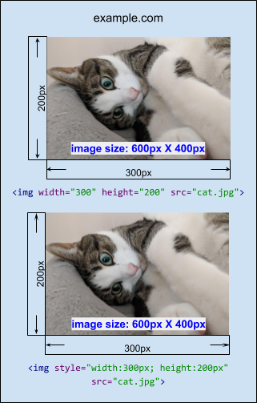
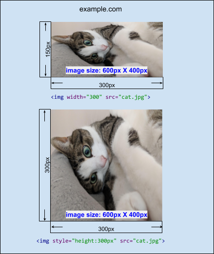
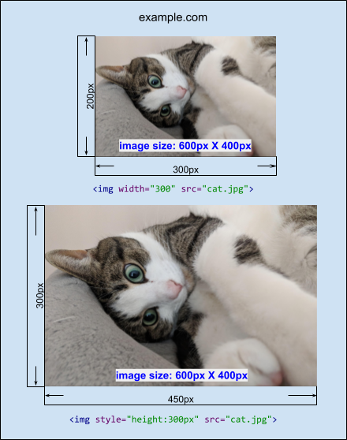
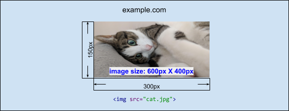
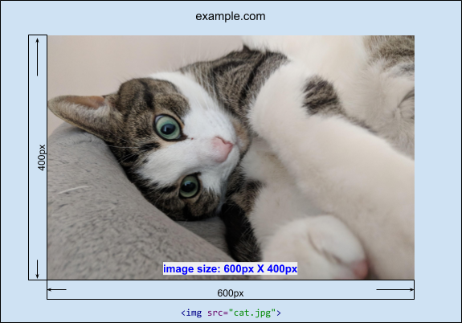

# Unsized Media Policy Explainer

loonybear@, last updated: 11/05/2018

<span style="color:#38761d;">Status: available in Chrome behind a flag</span>


## Goal

Layout instability is one of the existing problems that are aggravating web experiences. For example, when the size of an `` element is unspecified, it will cause the content around the `` element to jump around. This is because the renderer does not know how much space to reserve for an image until the image is loaded, and once the image size is known the renderer will have to re-layout everything, causing the content to shift on the web page.

Unsized media policy is aiming to fix the problem by requiring all media elements to provide a size; if they don't, a default will be chosen, so that the image doesn't change size after loading.


## Background: "intrinsicSize"

`unsized-media` policy is defined to set default value of the `intrinsicSize` attribute if not otherwise specified.

`intrinsicSize` attribute tells the browser to ignore the actual intrinsic size of the image and pretend it’s the size specified in the attribute. Please read the [explainer for "intrinsicSize" attribute](https://github.com/WICG/intrinsicsize-attribute/blob/master/README.md) for more details.


## What is "unsized-media"?

`unsized-media` is a policy-controlled feature. It restricts images to have specified sizes. When a document is disallowed to use `unsized-media`, the intrinsic size (defined by the ['intrinsicSize' attribute](https://github.com/ojanvafai/intrinsicsize-attribute/blob/master/README.md)) of ``, `<video>`, and `<svg:image>` elements will be set to default ("300 x 150") unless otherwise specified. So, for exmaple:

* If no width/height are specified, and no `intrinsicSize` value is set, then the image's intrinsic size is set to default (300px by 150px) and the image is rendered by the default dimension (300px by 150px)
* If the width (or height) is set, but `intrinsicSize` value is not specified, then the image's intrinsic size is set to default (300px by 150px) and the image's height (or widht) is set to maintain the default intrinsic aspect ratio (300 / 150)
* If the width and height are set on the image, but `intrinsicSize` value is not specified, then the image's intrinsic size is set to default (300px by 150px) but the image is rendered by the width and height specified.

Note: When 'intrinsic size' is set to default, a image's naturalWidth/naturalHeight will return the default value (300/150).

* If no width/height are specified, but `intrinsicSize` value is set, then the image is rendered by the dimension specified by the `intrinsicSize` attribute
* If the width (or height) is set, and `intrinsicSize` value is set, then the image's height (or width) is set to maintain the aspect ratio specified by the `intrinsicSize` attribute
* If the width and height are set on the image, and `intrinsicSize` value is specified, then the image is rendered by the width and height specified and the image's intrinsic size is overridden by 'intrinsicSize'


### Specification

- The default allowlist for `unsized-media` is `*`. In other words, `unsized-media` is enabled for all origins by default.

- An `unsized-media` policy can be specified via:

    **1.  HTTP "Feature-Policy" response header**
    ```html
    Feature-Policy: unsized-media 'none';
    ```
    In this example, `unsized-media` is disabled for all frames including the main frame. All "media" elements will be using the default intrinsicSize ("300 X 150") unless otherwise specified.

    **2. "allow" attribute in <iframe>**
    ```html
    <iframe src="https://example.com" allow="unsized-media 'self' https://foo.com;">
    ```
    In this example, `unsized-media` is disabled everywhere except on the origin of the main document and on `https://foo.com`.


### Examples

<table>
  <tr align="center">
   <td width="400">Feature-Policy: unsized-media 'none'; </td>
   <td width="400">Feature-Policy: unsized-media *; </td>
  </tr>
  <tr align="center">
   <td>

   </td>
   <td>

   </td>
  </tr>
  <tr align="center">
   <td colspan="2">

```html
"example0.com"


```
   </td>
  </tr>
</table>

For any ``, `<video>`, or `<svg:image>` element, if its width and height are specified, then the element will be rendered using its specified size, regardless of the state of the policy.


<table>
  <tr align="center">
   <td width="400">Feature-Policy: unsized-media 'none'; </td>
   <td width="400">Feature-Policy: unsized-media *; </td>
  </tr>
  <tr align="center">
   <td>

   </td>
   <td>

   </td>
  </tr>
  <tr align="center">
   <td colspan="2">

```html
"example1.com"


```
   </td>
  </tr>
</table>

For an ``, `<video>`, or `<svg:image>` element, if one dimension is specified, the other dimension will be determined by the intrinsic aspect ratio (if not specified by the `intrinsicSize` attribute, use "300 x 150" as default), when `unsized-media` is disallowed.


<table>
  <tr align="center">
   <td width="400">Feature-Policy: unsized-media 'none'; </td>
   <td width="400">Feature-Policy: unsized-media *; </td>
  </tr>
  <tr align="center">
   <td>

   </td>
   <td>

   </td>
  </tr>
  <tr align="center">
   <td colspan="2">

```html
"example2.com"


```
   </td>
  </tr>
</table>

For an ``, `<video>`, or `<svg:image>` element, if both dimensions are unspecified, use intrinsic dimensions (if unspecified by the `intrinsicSize` attribute, use "300 x 150" as default), when `unsized-media` is disallowed.


